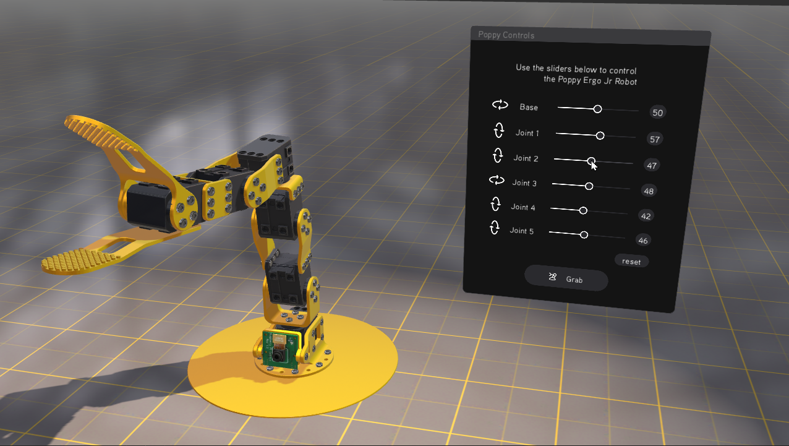

# Harfang GUI

**Harfang GUI** is a _immediate mode_ GUI library built on top of HARFANG® 3D.
It supports 2D, 3D & VR (wip).  

___
## Overview  
* Easy 2D/3D/VR GUI creation with HARFANG® 3D Python
* Immediate mode, inspired by the API of [DearImGui](https://github.com/ocornut/imgui)

## Requirements

* Python 3.6+
* HARFANG 3D for Python
* **Harfang Core shaders**
  * `"shaders/font"` to fonts rendering.  
  * `"fonts/..."` as fonts library. Copy your fonts here if you need custom ones.
* **Harfang Gui specific assets**  
  * `"assets/hgui_textures"` contains core textures (VR mouse pointer, widgets textures...)  
  * `"assets/hgui_shaders"` contains the shaders.  

___
## Widgets types

The current version of the Harfang GUI API provides the following widgets:

- Window 2D / 3D  
- Info text  
- Button  
- Button image  
- Image  
- Check box  
- Input text  
- Scrollbar (vertical & horizontal)  
- Radio image button
- Toggle button
- Toggle image
- ListBox
- Slider float
- Widgets group

## How to use Harfang GUI?

>Please check the code samples to see how to use the library.

## How to run the samples?

### Run the samples from the release file _(the easy way)_: :v:
1. Download the latest release (`harfang-gui-demos-hg3.X.X.zip`)
2. Unzip it
3. Run `1-compile_content.bat`
4. Run `2-start-window2d.bat`
5. and so on!
### Run the samples from the sources _(the way of the warrior)_: :metal:

1. Download or clone this repository to your computer _(eg. in `C:/harfang-gui`)_.
2. Download _assetc_ for your platform from [here](https://harfang3d.com/releases) and unzip it in `bin/assetc`.
3. To compile the resources, drag and drop the resources folder on the assetc executable **-OR-** execute assetc passing it the path to the resources folder _(eg. `assetc C:/source/assets`)_.

   

   After the compilation process finishes, you will see a `assets_compiled` folder next to resources ( `assets` ) folder.

4. You can now execute the samples from the folder `source`.
